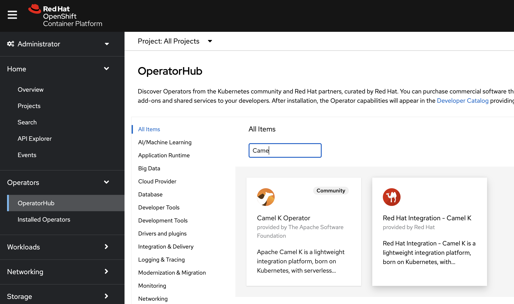
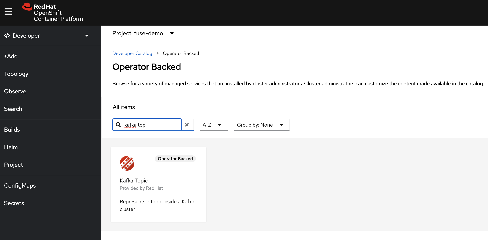
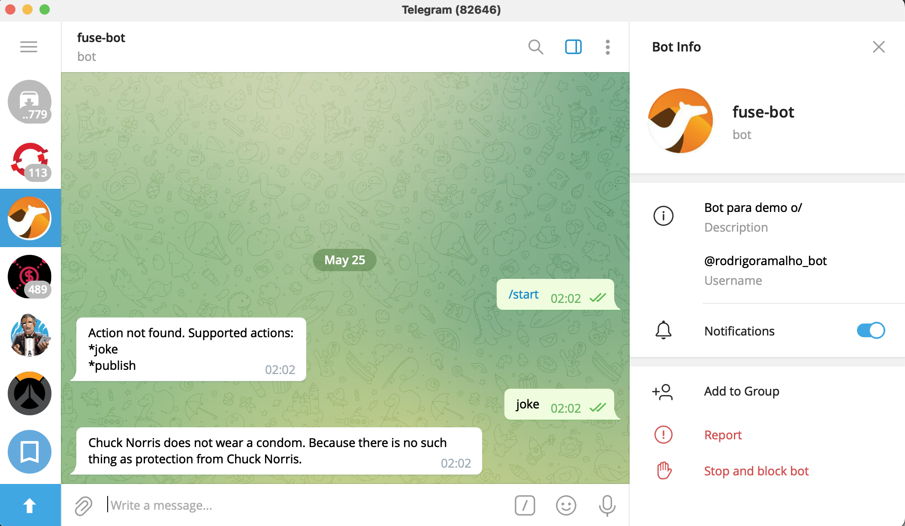
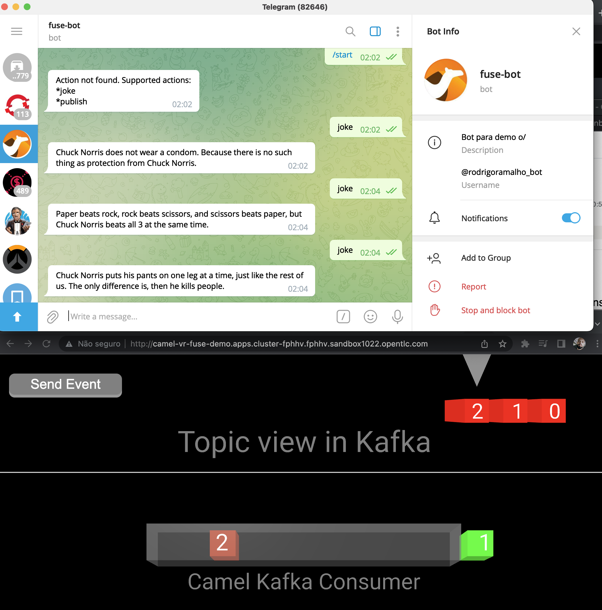

= Camel Demo

This is a simple demo that consist in two parts. 

. The first one using **Camel with Quarkus** does not describe a real use case but focuses in show some main core concepts of Camel and how easy it enables to create cloud-native integrations.

. The second one is based on an event-driven architecture scenario where we create a Telegram chatbot using **Camel-K**. 
It interacts with the user via a chatbot in Telegram and also publishes the messages on a Kafka topic.

== Visual Studio Code Plugins

During the demo Visual Studio Code will be the IDE in use, with the following plugins:

* https://marketplace.visualstudio.com/items?itemName=redhat.apache-camel-extension-pack[Extension Pack for Apache Camel]
* https://marketplace.visualstudio.com/items?itemName=redhat.vscode-quarkus[Quarkus Plugin]

== Install the Operators

. Red Hat Integration - AMQ Streams
. Red Hat Integration - Camel K

== Camel Quarkus

This first part demo will explore some Camel fundamental concepts:

. Bootstrap a Camel Quarkus project
. Usage of multiple components (timer, log, file)
. How to use parameters
. Bean Invocation 
. Integration Patterns (CBR)
. Data Transformation to XML and JSON

This is the use case that we are going to explore

Generate two objects using the time component, filter them using the Content-Base Router EIP, and log them to the console. The objects that have the item object equals `ActiveMQ` transform it to `JSON` and save it in the filesystem using the file component. The Order object with the attribute `item` equals `Camel` we transform to `XML` and save in the filesystem.

Let's generate the project using the Quarkus Bootstrap website.

Download a quarkus project using the https://code.quarkus.redhat.com[Quarkus bootstrap], select the followings extensions:

. camel-quarkus-timer
. camel-quarkus-log
. camel-quarkus-bean
. camel-quarkus-file
. camel-quarkus-core
. camel-quarkus-jackson
. camel-quarkus-jacksonxml

image::imgs/quarkus-bootstrap.png[]

After click on **Generate your application** button, and download the zip. After, unzip it and run the project to see if everything is ok with your environment.

    ./mvnw compile quarkus:dev

You also have the option to use the https://quarkus.io/guides/cli-tooling[Quarkus CLI].

Fine, if everything it's fine let's create our first Camel Route.

A Camel Route is a class that extends `RouteBuilder` and implements the configure method. Create a new java class and extends it from `RouteBuilder` and in the `configure` method, start with the code below:

    from("timer:live-demo")
        .log("Hello router!");

This code is using the timer component, with all default configurations, it will be executed in a forever the message *Hello router!"* in the console in a specific frequency.

Components are the key of Camel. They are flexible and reusable  "libraries" that abstract complex operations making it trivial, boosting developer productivity!

https://camel.apache.org/components/latest[Take a look at the camel components, window="_blank"]

Now, let's use some parameters with timer component to repeat *only 2 times*

    from("timer:generate?repeatCount=2)
        .log("Hello router!");

More parameters can be used adding the & as a query parameter.

image::imgs/camel-structure.png[]

Keep evolving the route development until to have the route like this:

    from("timer:live-demo?repeatCount=2")
        .log("first camel application")
        .bean(OrderService.class, "generateOrder")
        .log("Pedido gerado ${body}")
        .choice()
            .when(simple("${body.item} == 'Camel'"))
                .log("Book tipo Camel")
                .marshal().json()
                .to("file:/tmp/demo?fileName=camel.json")
            .otherwise()
                .log("Book tipo ActiveMQ")
                .marshal().jacksonxml()
                .to("file:/tmp/demo?fileName=activemq.xml");

`.bean` in line 3 allows us to call methods in the java class.

`.choice()` is the content base router that allows us to filter based on the content.

`marshal()` is what allows data type conversion in Camel, in this case, we are converting a Java Object into a file (JSON or XML). If we are doing the opposite converting a file to Java Object the `unmarshal()` must be used.

To deploy it in Openshift, since you are already logged in and in the correct project, use: 

    ./mvnw clean package -Dquarkus.kubernetes.deploy=true -Dquarkus.kubernetes-client.trust-certs=true -DskipTests

Think of Camel as a pipeline that transports things *from* someplace to *another one*, and this message body flows through the pipes.

Camel’s syntax is inspired by the UNIX pipeline. In UNIX, we might execute something like `ps -fe | grep foo`. When we run this command, the output of the `ps` command becomes the input to the `grep` command. We “pipe” the output of one command into the input of another command.

Camel chains these actions together in an object called an `Exchange`, which consists of an input message (called the “In” message), some sort of processor (like a component, for instance) and possibly an output or “Out” message if the processor is meant to provide a synchronous response.

A series of `Exchange` state changes creates a Camel Route.

image::imgs/camel-pipeline.png[]

Take some time and take a look at https://access.redhat.com/documentation/en-us/red_hat_fuse/7.10/html/apache_camel_development_guide/basicprinciples[this documentation] to understand better how the Camel pipeline works.

== Chat bot with Camel-K

This second part has more fun since it is more closely with a real use case. It uses Camel-K.

https://camel.apache.org/camel-k/1.9.x/index.html[Apache Camel K] is a lightweight integration framework built from Apache Camel that runs natively on Kubernetes and is specifically designed for serverless and microservice architectures.

To run you need the camel-k binary, download the latest version:

https://mirror.openshift.com/pub/openshift-v4/clients/camel-k/latest/camel-k-client-1.6.3-linux-64bit.tar.gz[Linux] | 
https://mirror.openshift.com/pub/openshift-v4/clients/camel-k/latest/camel-k-client-1.6.3-mac-64bit.tar.gz[Mac] | 
https://mirror.openshift.com/pub/openshift-v4/clients/camel-k/latest/camel-k-client-1.6.3-windows-64bit.tar.gz[Windows]

Install the Camel-K Operator.

As we are going to create a Telegram chatbot you will need to https://core.telegram.org/bots[create a bot] and take a note of your bot `api-key`.

All content that we will need to work is inside the `camel-k` directory. We not need a java project to run the integration with Camel-K, just a single class is enough.

Change the `application.properties` file with your Telegram credentials.

Create the secret in Openshift

    cd camel-k
    oc create secret generic telegram-bot --from-file application.properties

Running the integration

    kamel run Telegram.java --dev --config secret:telegram-bot

The first version looks like this:

    from("telegram:bots")
        .log("command received ${body}")
        .convertBodyTo(String.class)
        .choice()
            .when(simple("${body} == 'joke'"))
                .log("action joke triggered")
                .to("http://api.icndb.com/jokes/random")
                .unmarshal().json(JsonLibrary.Jackson)
                .transform(simple("${body[value][joke]}"))
                .to("telegram:bots")
            .when(simple("${body} == 'publish'"))
                .log("action publish triggered")
            .otherwise()
                .setBody().simple("Action not found. Supported actions:\n*joke\n*publish")
                .to("telegram:bots");

I would recommend to do it incremental, just show it receiving messages from Telegram, after answering back.
Once it is clear, continue to evolve the logic.

This is a simple bot that allows to receive two actions `joke` and `publish`.

`joke` calls the chuck norris REST api, handle the JSON response and show it Telegram as an answer to the `joke` command. 

`publish` is just an example to other action, that here at least until now it does nothing.

Now, we are going to not only answer back to telegram but also publish into a Kafka topic. 

For it, we need a Kafka cluster running, so deploy https://strimz.io[AMQ Streams] in your Openshift with the name `my-cluster`. For this demo you can use all the default values.

After create a topic, called `my-topic`.

If everything is working fine with your Kafka instance, you must be seeing something like that.

Returning to the application, uncomment the first line `camel.component.kafka.brokers` from the `application.properties` file, and recreate as a secret in Openshift. 

    oc delete secret telegram-bot
    oc create secret generic telegram-bot --from-file application.properties

Run the Camel-K application:

    kamel run Telegram.java --dev --config secret:telegram-bot

To be able to visualize the messages being received in that topic you should deploy the `Camel VR` application. 

    oc process -f vr-template.yml \
        -p NAMESPACE=fuse-demo \
        -p KAFKA_BROKER=my-cluster-kafka-bootstrap:9092 \
        -p KAFKA_TOPIC=my-topic \
        -p SUBDOMAIN=apps.cluster-k42fg.k42fg.sandbox739.opentlc.com \
        | kubectl apply -f -    

Once it's finished you can now, add the following line in your Camel-K route, just after the .to(`telegram:bots`)

    .to("telegram:bots")
    .to("kafka:my-topic")

Look in the VR application, the messages being received.

If everything worked fine in your setup, you should see something like that:

image::imgs/camel-k-overview.png[]

And the demo execution, something similar to it

As you can see the message content is not the best, use at your own risk :-)

To check the entire list of supported actions in the VR application, access the application route and add the following in the end of the URL: `/webjars/swagger-ui/2.1.0/index.html?url=/camel/api-docs` (Make sure you are not using https)